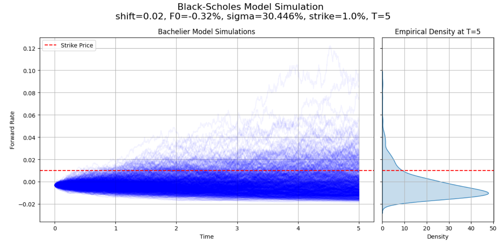

# Option pricing and stochastic processes

**Notable technologies and methods**

 - `Option pricing and implied volatility calculation`
 - `Stochastic calculus using Monte carlo simulations`

**Summary**

This repository contains two exercies related to option pricing and stochastic calculus.

1. **Q2:** This notebook replicates the results which are shown in the [blog post by John Hull](https://fincad.com/blog/interest-rate-models-and-negative-rates). Main purpose of this blog post is to show that using Black-Scholes model in the environment of very low or negative interest rates implies some implausible properties. More precisely, a shift is introduced to the log-normal distribution to allow for negative interest rates. However, implied volatiliy is heavily dependent on the size of the shift parameter. To overcome this issue, Bachelier model is used instead which uses normal distribution instead of the log-normal one and therefore allows for the negative interest rates without using the shift parameter.
2. **Q8:** This notebook uses Monte Carlo simulations to find the maximum of two correlated Weiner processes at given time period T.